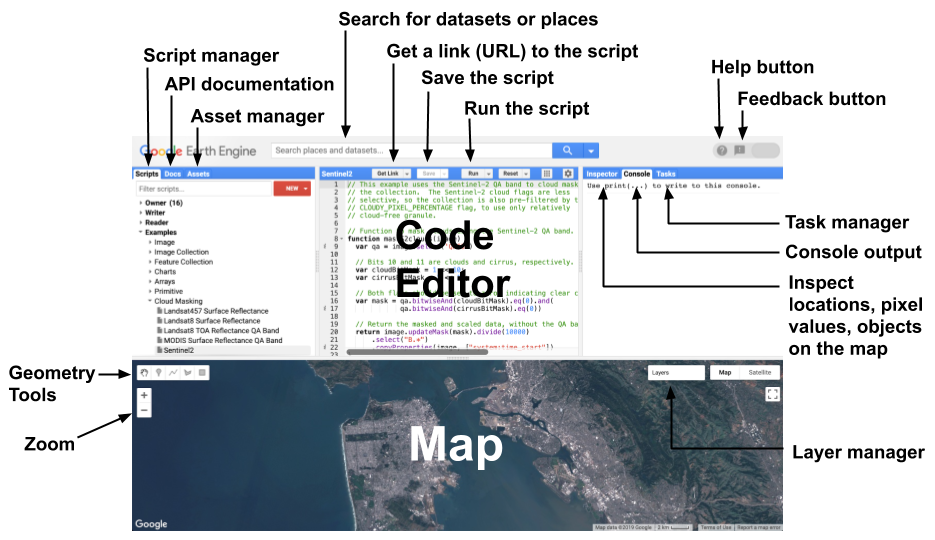

# CS 106S: CS for Climate Change
Starter code for class, based on the Earth Engine tutorials at https://developers.google.com/earth-engine/tutorials/tutorial_api_02.

Diagram from this <a href = "https://developers.google.com/earth-engine/guides/playground">link</a>.

 
Instead of downloading the code as a ZIP folder and opening in VS code, this week, you'll want to copy the code snippets into the Earth Engine code editor (top middle panel with the `RUN` and `RESET` buttons). You can access the engine at https://code.earthengine.google.com/, signing in with your email of registration (ideally your Stanford email). 

You'll find 

- `elevation_map.js`: For visualizing an elevation map of the Grand Canyon and use false-color palettes to elucidate topographical features.
- `sat_mosaic.js`: For visualizing a temporal mosaic of Landsat satellite data captured over the 2016 year.
- `vegetation.js`: For calculating the vegetation indices of Landsat imagery, as well as changes over time.
- `forest_cover.js`: For tracking global deforestation through forest cover maps.
- `supplementary.js`: Supplemental reference code (specifically for MODIS satellite and precipitation data)

Within each code file, the listed parts are all *self-contained*---that is, each constitute an entire code script for the Earth Engine.
